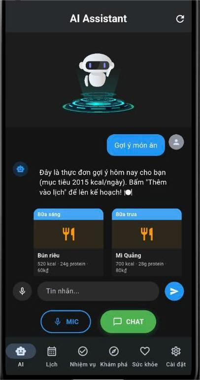
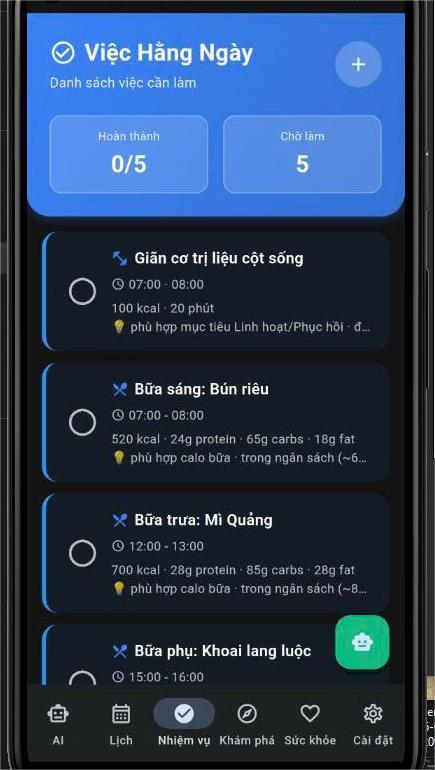
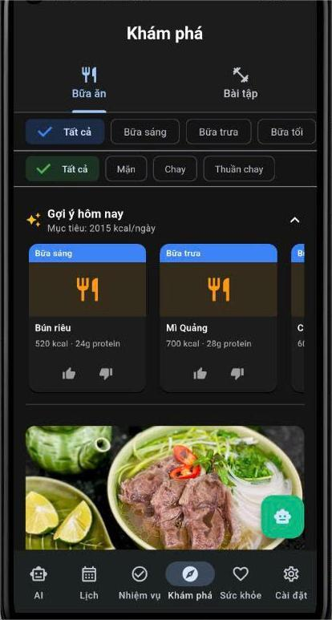
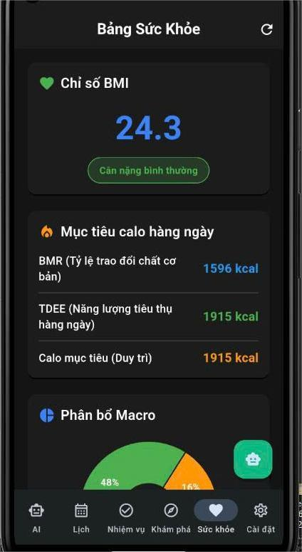

<p align="center">
  
</p>

<h1 align="center">LifeGrid 360</h1>

<p align="center">
  <strong>AI-Powered Health & Wellness Companion for Vietnamese Students</strong>
</p>

<p align="center">
  <a href="https://life-grid-360.vercel.app">Landing Page</a> &middot;
  <a href="https://github.com/hiungn/LifeGrid360/releases/latest">Download APK</a>
</p>

<p align="center">
  
  
  
  
  
</p>

---

## Screenshots

<p align="center">
  
  &nbsp;
  
  &nbsp;
  
  &nbsp;
  
</p>

---

## About

LifeGrid 360 is a mobile health & wellness app designed specifically for Vietnamese university students. It combines an AI assistant, smart calendar, nutrition tracking, and workout recommendations into a single platform.

This is a capstone project built by a team of 4 students at **FPT University HCM** (Summer 2026).

### Key Features

| Feature | Description |
|---------|-------------|
| **AI Assistant** | Context-aware chatbot powered by Llama 3.3 70B (via Groq). Suggests personalized meals & workouts based on your goals, preferences, and history. |
| **Smart Calendar** | Google Calendar sync, event reminders 5 min before (vibration + sound), daily morning summary at 07:00. |
| **Home Screen Widget** | Android widget showing today's schedule directly on your home screen. |
| **Health Dashboard** | BMI, TDEE, BMR calculation with macro breakdown charts. |
| **Meal Plans** | 100+ Vietnamese dishes with full nutrition data (calories, protein, carbs, fat, cost). AI-ranked by your preferences. |
| **Workout Library** | Diverse exercises by difficulty, equipment, and muscle group. |
| **Preference Learning** | The AI learns your behavior over time via feature vectors — the more you use it, the smarter it gets. |
| **Tier System** | FREE (30 AI messages/day), STUDENT/PRO (unlimited + personalized AI + mascot companion). |

---

## Tech Stack

```
Mobile App        Flutter 3.5 + Provider + Dio + Material Design 3
Backend           Node.js + Express + TypeScript + Socket.IO
Database          PostgreSQL (Neon) + Prisma ORM (21 models)
AI Engine         Groq Free Tier (Llama 3.3 70B) + Agent Architecture
Auth              JWT + RBAC (User/Admin roles)
Email             Resend API
Hosting           Render.com (backend) + Vercel (landing page)
Landing Page      Next.js 16 + Tailwind CSS 4 + Framer Motion
```

### Architecture

```
┌──────────────┐     REST + WebSocket     ┌──────────────────┐
│  Flutter App │ ◄──────────────────────► │  Express Backend │
│  (Android)   │                          │  (TypeScript)    │
└──────────────┘                          └────────┬─────────┘
                                                   │
                                    ┌──────────────┼──────────────┐
                                    │              │              │
                              ┌─────▼─────┐ ┌─────▼─────┐ ┌─────▼─────┐
                              │ PostgreSQL │ │ Groq API  │ │  Resend   │
                              │   (Neon)   │ │ Llama 3.3 │ │  Email    │
                              └───────────┘ └───────────┘ └───────────┘
```

---

## AI System

The AI system goes beyond a simple chatbot wrapper:

- **Agent Architecture** — Orchestrates multi-step reasoning with tool use (meal lookup, workout search, health data retrieval)
- **Provider-Agnostic LLM** — OpenAI-compatible API layer, easily swappable between Groq, OpenAI, or any provider
- **Feature Learning** — Computes user behavior vectors from interaction history, building a personalized preference profile
- **Smart Scoring** — Meals and workouts are ranked by learned weights (calorie fit, protein ratio, budget, cuisine preference, difficulty match)
- **Tier-Aware** — FREE users get default weights; STUDENT/PRO users get fully personalized AI with learned preferences

---

## Download

| Variant | Size | For |
|---------|------|-----|
| [arm64-v8a](https://github.com/hiungn/LifeGrid360/releases/latest) | 24.4 MB | Most modern phones |
| [armeabi-v7a](https://github.com/hiungn/LifeGrid360/releases/latest) | 22.6 MB | Older devices |
| [x86_64](https://github.com/hiungn/LifeGrid360/releases/latest) | 25.8 MB | Emulators |

**Requirements:** Android 7.0+ (API 24)

---

## Team

| Name | Role |
|------|------|
| **Nguyen Trong Hieu** | Lead Developer — Full-stack, AI, DevOps |
| **Luu Duc Anh** | Backend Developer |
| **Le Tu Quoc Huy** | Mobile Developer |
| **Vu Hoang Minh Khanh** | UI/UX Designer |

Built at **FPT University Ho Chi Minh City** — Summer 2026

---

## Links

- **Landing Page:** [life-grid-360.vercel.app](https://life-grid-360.vercel.app)
- **Download:** [GitHub Releases](https://github.com/hiungn/LifeGrid360/releases/latest)
- **Contact:** lifegrid360@gmail.com

---

<p align="center">
  <sub>This is a capstone project. Source code is kept private. This repository serves as a public showcase.</sub>
</p>
